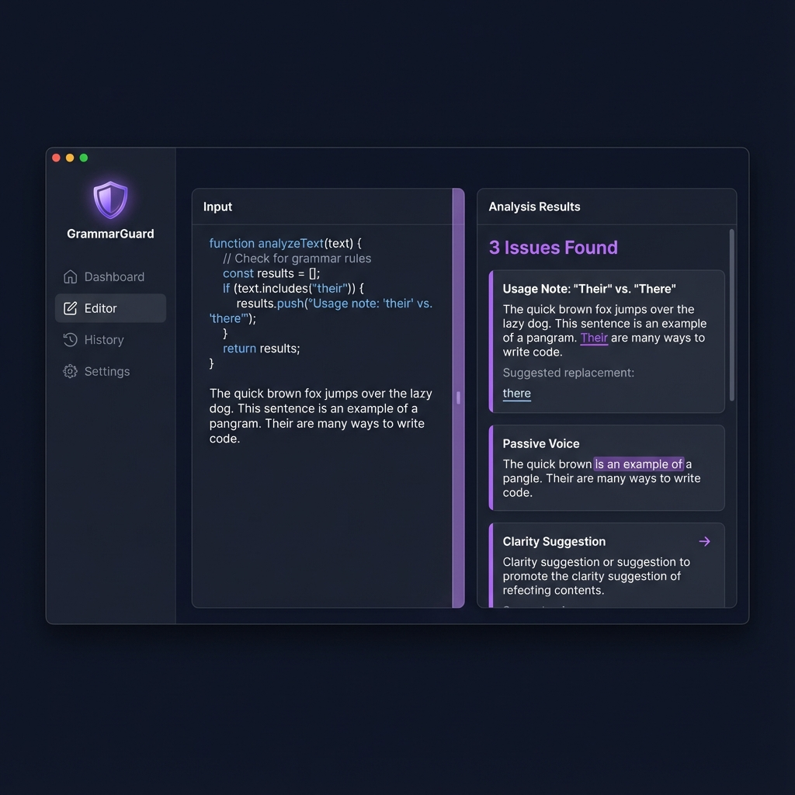

# GrammarGuard 🛡️

> **A privacy-first AI grammar corrector that runs 100% offline.**

[](https://opensource.org/licenses/MIT)
[](https://www.python.org/)
[](https://spacy.io/)
[]()

**GrammarGuard** is a desktop GUI application designed for those who value data sovereignty. Unlike popular grammar tools that send your keystrokes to the cloud, GrammarGuard processes everything locally on your machine.

Whether you are working on sensitive legal documents, proprietary code comments, or personal journals, GrammarGuard ensures your text never leaves your computer.


*(Note: Add a screenshot of your GUI here)*

---

## ✨ Key Features

* **🔒 100% Offline & Private:** No API calls, no cloud servers, no data tracking. Your data stays on your local drive.
* **🖥️ User-Friendly GUI:** A clean, minimal desktop interface designed for distraction-free editing.
* **⚡ Powered by SpaCy:** Utilizes industrial-strength Natural Language Processing for accurate syntax and grammar analysis.
* **📄 File Support:** Import and correct `.txt`, `.md`, and `.docx` files directly.
* **🚀 Local Inference:** Optimized for local performance to provide fast feedback without network lag.

---

## 🛠️ Tech Stack

* **Language:** Python 3.9+
* **NLP Engine:** [spaCy](https://spacy.io/)
* **GUI Framework:**: flutter


---

## 📥 Installation

### Prerequisites

Ensure you have Python installed. GrammarGuard relies on `spaCy` and its language models.

### 1. Clone the Repository
```bash
git clone [https://github.com/yourusername/grammarguard.git](https://github.com/yourusername/grammarguard.git)
cd grammarguard
